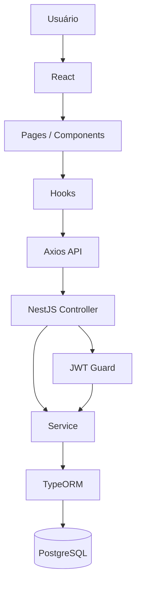

# Encanto Telecom Ticket
Projeto prático para a etapa do processo seletivo da Encanto Telecom.

# Desenvolvedor
Eduardo Henrique Natividade Pinese

# Lista de Stacks

### Frontend
- [x] TypeScript
- [x] React 18 (hooks)
- [x] Tailwind CSS
- [x] Formik - Gerenciamento e controle de formulários. Login / Registro / New Ticket / Edit Ticket
- [x] Yup - Validação de dados dos formulários. 
- [x] Axios - Consumo e integração com APIs REST desenvolvido com Nestjs.
- [x] React Router - Navegação entre páginas da aplicação.

### Backend
- [x] TypeScript
- [x] NestJS
- [x] PostgreSQL - Banco de dados relacional da aplicação.
- [x] TypeORM - Mapeamento das entidades e comunicação com o banco.
- [x] class-validator - Validação dos DTOs de entrada e retorno.
- [x] JWT - Autenticação e autorização baseada em tokens. Token definido após o login e segurança das rotas de Tickets com JwtGuard
- [x] bcrypt - Criptografia e proteção das senhas. Implementado no módulo de Auth
- [x] Jest - Testes unitários dos serviços backend. Auth / Tickets

### Infra
- [x] Docker - Criação de containers para padronizar o ambiente de desenvolvimento.
- [x] docker-compose - Gerenciamento dos serviços e configuração do banco PostgreSQL.

### Extra
- [ ] IA Gemini - Integração com a API Gemini para sugerir soluções automáticas aos usuários com base na descrição do ticket.

# Fluxo de dados

O frontend utiliza uma arquitetura Feature-Based, onde cada funcionalidade possui suas próprias páginas, componentes, hooks e camada de API. As requisições são realizadas via Axios com autenticação JWT. No backend, os Controllers recebem as requisições, os Services aplicam as regras de negócio e o TypeORM faz a persistência dos dados no PostgreSQL.



# Como executar

## Backend

```bash
cd backend

npm install

docker-compose up -d

npm run start:dev
```

A API disponível em:

http://localhost:3000

---

## Frontend

```bash
cd frontend

npm install

npm run dev
```

Aplicação disponível em:

http://localhost:5173

# Variáveis de ambiente

## Backend (.env)

```env
PORT=3000

DATABASE_HOST=localhost
DATABASE_PORT=5432
DATABASE_USER=postgres
DATABASE_PASSWORD=postgres
DATABASE_NAME=helpdesk

JWT_SECRET=...
JWT_EXPIRES_IN=1d
```

## Frontend (.env)

```env
VITE_API_URL=http://localhost:3000
```

# Aprendizados / Facilidades
1. Durante o desenvolvimento do Frontend em React, notei familiaridade com frameworks que trabalhei no passado
Além disso, é muito interessante a forma como o React facilita a componentização das views.

2. Apliquei para esse projeto a estrutura orientada à Features, onde se dá destaque para as features a serem desenvolvidas.
Pelo projeto ser pequeno em features

3. Nest.js possui uma certa semelhança com a criação e definição de rotas e lógica comparado ao Java Springboot.

# Problemas e Bugs
1. Na instalação do Docker, encontrei muitos problemas de permisão ao acesso de pastas internas do computador. Utilizando o auxílio de IA para resolver, a instalação e setup do Docker foi bem-sucedido

2. Jest não veio configurado corretamente. Arquivos de teste automaticamente gerados pelo Nest.js quebraram. Precisei criar "tsconfig.specs.json" na root e adicionar tipos de compilação no "tsconfig.json"

